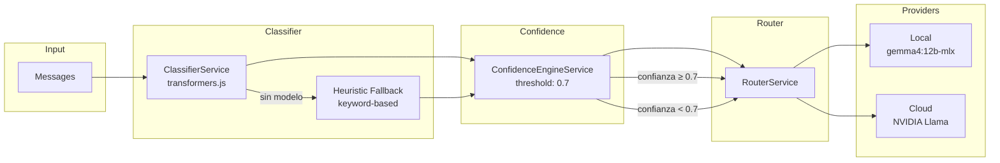
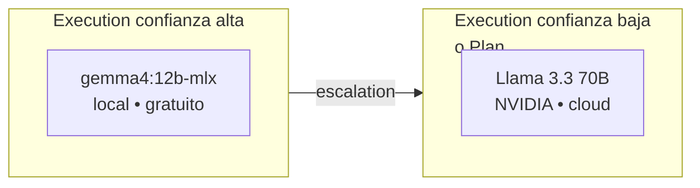
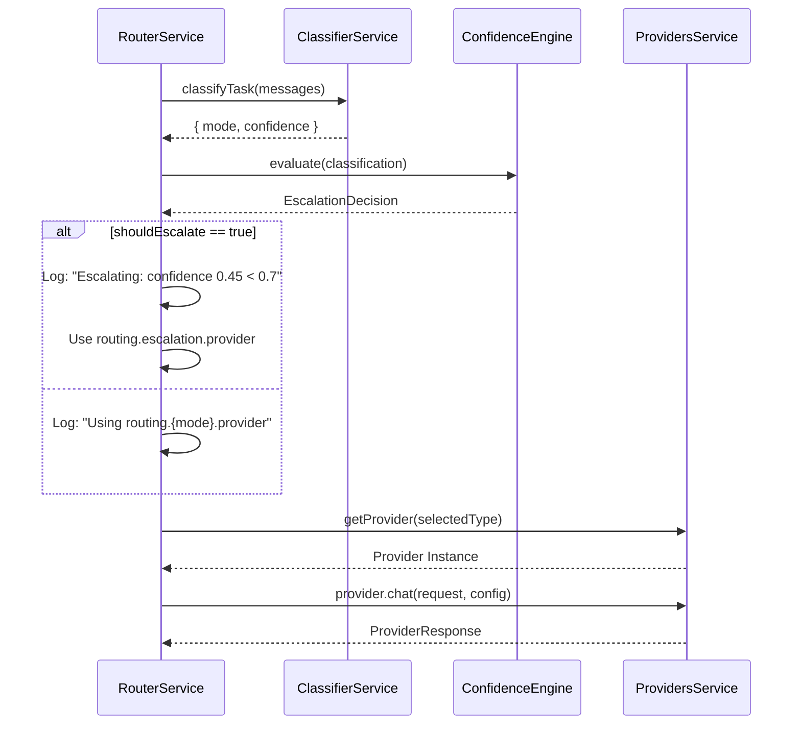
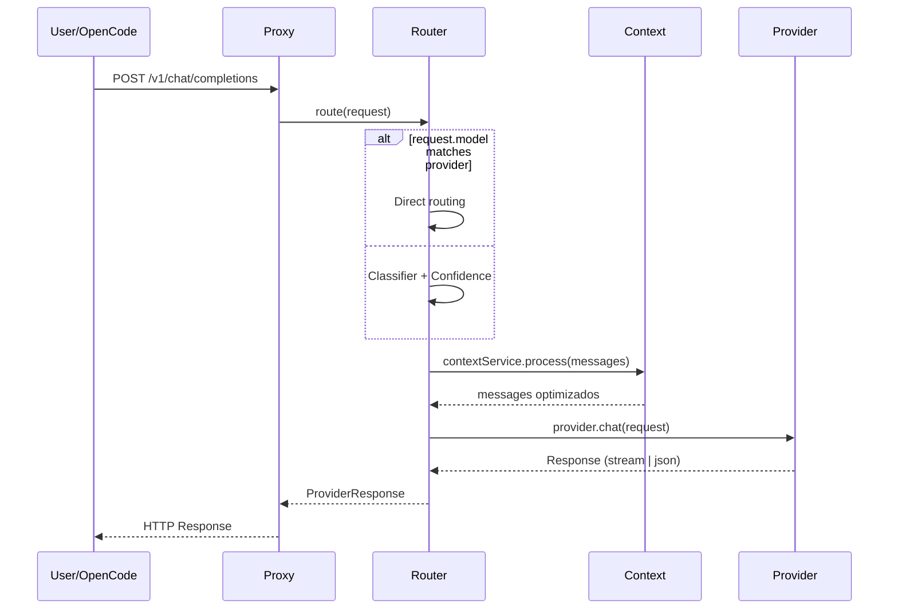

# Confidence Engine + Escalation System — Diseño Técnico

## Objetivo

Decidir cuándo escalar de un modelo local a uno cloud basándose en la **confianza** que el clasificador
tiene sobre el tipo de tarea. Si la confianza es baja, se usa un modelo más capaz (y más caro).

---

## Arquitectura General



---

## Fase 1: Clasificador de Tareas

### Zero-Shot Classification

El clasificador usa **mobilebert-uncased-mnli** via `@xenova/transformers`.
No requiere fine-tuning: funciona con zero-shot classification sobre dos labels predefinidas.

### Labels

| Label | Descripción | Ruta |
|---|---|---|
| `system planning and architecture` | Tareas de diseño, planificación, arquitectura | → cloud (plan) |
| `code execution and simple fix` | Implementación, debugging, refactors simples | → local (execution) |

### Pipeline

```mermaid
flowchart TD
    A[Mensajes del usuario] --> B[Serializar a string JSON]
    B --> C{ClassifierService<br/>initialized?}
    C -->|Sí| D[zero-shot classification<br/>mobilebert-uncased-mnli]
    C -->|No| E[Heuristic Fallback<br/>keywords: plan, architect, system design]
    D --> F{Label[0] === 'planning'?}
    F -->|Sí| G[{ mode: 'plan', confidence: scores[0] }]
    F -->|No| H[{ mode: 'execution', confidence: scores[0] }]
    E --> I[{ mode: 'plan'|'execution', confidence: 0.5 }]
```

### Heuristic Fallback

Cuando el modelo no está disponible (no descargado, error), se usa un fallback determinista
basado en palabras clave:

```typescript
private heuristicFallback(text: string): ClassificationResult {
  const textLower = text.toLowerCase();
  if (textLower.includes('plan') ||
      textLower.includes('architect') ||
      textLower.includes('system design')) {
    return { mode: 'plan', confidence: 0.5 };
  }
  return { mode: 'execution', confidence: 0.5 };
}
```

La confianza de 0.5 en fallback **siempre** activa el escalado, porque está por debajo del threshold 0.7.

---

## Fase 2: Confidence Engine

### Threshold Configurable

El threshold se define en `routing.yaml`:

```yaml
confidence:
  threshold: 0.70
```

Si no está configurado, el valor por defecto es `0.7`.

### Regla de Decisión

```mermaid
flowchart TD
    A[ClassificationResult<br/>{ mode, confidence }] --> B{confidence < threshold?}
    B -->|Sí| C[shouldEscalate = true]
    B -->|No| D[shouldEscalate = false]
    C --> E[targetProviderKey = routing.escalation.provider]
    D --> F[targetProviderKey = routing.{mode}.provider]
    E --> G[EscalationDecision]
    F --> G
```

### Implementación

```typescript
evaluate(result: ClassificationResult): EscalationDecision {
  const threshold = this.configService.get('confidence')?.threshold ?? 0.7;
  const routing = this.configService.get('routing') || {};

  const shouldEscalate = result.confidence < threshold;

  return {
    shouldEscalate,
    threshold,
    confidence: result.confidence,
    targetProviderKey: shouldEscalate
      ? routing.escalation?.provider    // ej: cloud_nvidia
      : routing[result.mode]?.provider, // ej: local_medium
  };
}
```

### Casos de Ejemplo

| Modo | Confianza | Threshold | ¿Escala? | Provider objetivo |
|---|---|---|---|---|
| execution | 0.95 | 0.7 | No | `local_medium` (gemma4 local) |
| execution | 0.45 | 0.7 | **Sí** | `cloud_nvidia` (Llama cloud) |
| plan | 0.91 | 0.7 | No | `cloud_nvidia` (Llama cloud) |
| plan | 0.30 | 0.7 | **Sí** | `cloud_nvidia` (Llama cloud) |
| execution | 0.50 | 0.7 | **Sí** | `cloud_nvidia` (fallback) |

---

## Fase 3: Escalation System

### Cadena de Escalado

El sistema soporta escalado en múltiples niveles, aunque en MVP solo hay dos:



### Integración con RouterService



### Configuración en routing.yaml

```yaml
providers:
  local_medium:
    type: ollama
    model: gemma4:12b-mlx      # 🟢 local, gratuito
  cloud_nvidia:
    type: cloud
    provider: nvidia
    model: meta/llama-3.3-70b-instruct  # 🔵 cloud, pago

routing:
  plan:
    provider: cloud_nvidia      # Plan siempre a cloud
  execution:
    provider: local_medium      # Execution a local
  escalation:
    provider: cloud_nvidia      # Escalado a cloud

confidence:
  threshold: 0.70               # Si confianza < 0.7 → escala
```

---

## Flujo Completo



---

## Configuración y Threshold

El threshold de 0.7 es un valor de inicio conservador. Ajustes recomendados:

| Threshold | Comportamiento | Uso |
|---|---|---|
| 0.9 | Casi todo escala a cloud | Máxima calidad, máximo coste |
| 0.7 | Balanceado (default) | Equilibrio calidad/coste |
| 0.5 | Solo escala lo dudoso | Más local, más ahorro |
| 0.3 | Casi nada escala | Máximo ahorro, riesgo calidad |

---

## Resumen

```
Input: "fix this bug in the login page"
  ↓
Classifier: { mode: 'execution', confidence: 0.92 }
  ↓
Confidence: 0.92 ≥ 0.7 → NO escalation
  ↓
Provider: local_medium → gemma4:12b-mlx (gratis)
  ↓
Output: respuesta desde modelo local


Input: "design the entire auth system architecture"
  ↓
Classifier: { mode: 'plan', confidence: 0.88 }
  ↓
Confidence: 0.88 ≥ 0.7 → NO escalation (pero ya va a cloud por ser plan)
  ↓
Provider: cloud_nvidia → Llama 3.3 70B (cloud)
  ↓
Output: respuesta desde modelo cloud


Input: "i dunno just make it work somehow"
  ↓
Classifier: { mode: 'execution', confidence: 0.35 }
  ↓
Confidence: 0.35 < 0.7 → ESCALATION
  ↓
Provider: cloud_nvidia → Llama 3.3 70B (cloud)
  ↓
Output: respuesta desde modelo cloud
```
