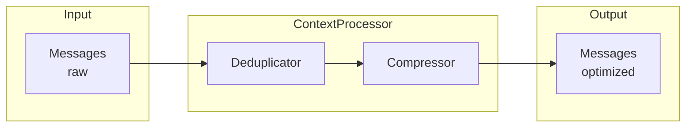
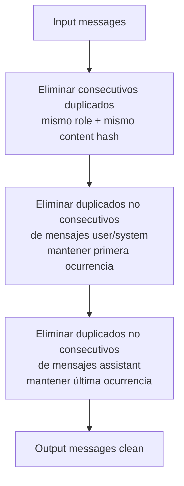
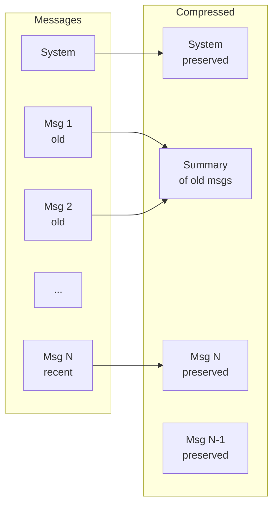
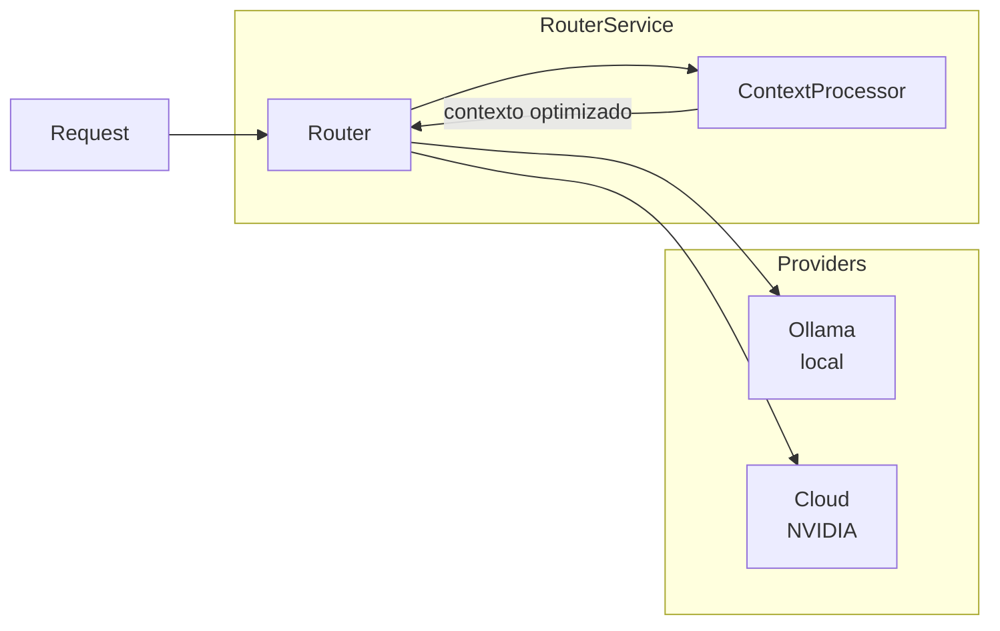
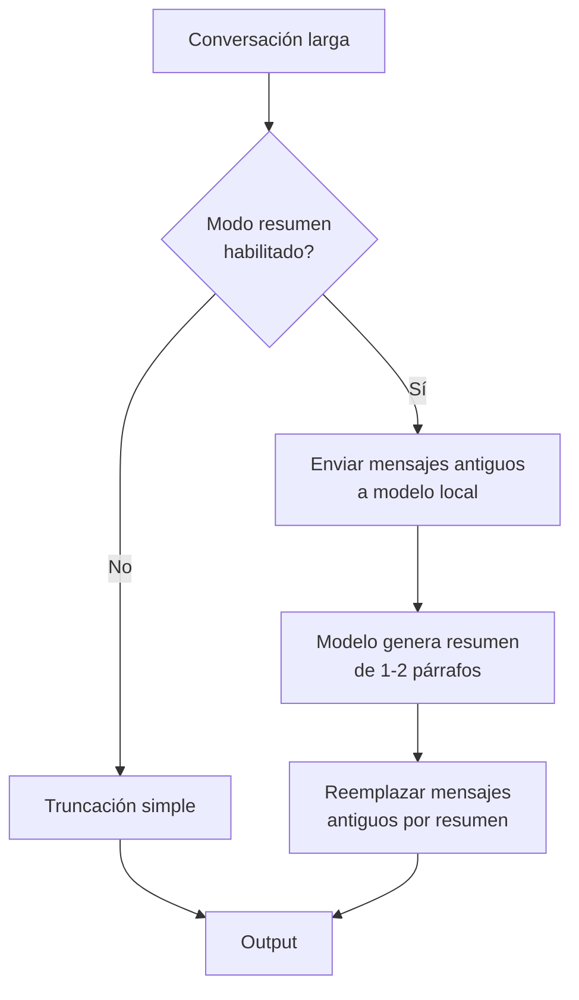

# Context Processor — Diseño Técnico

## Objetivo

Reducir el número de tokens que se envían a los modelos de lenguaje, tanto locales como cloud,
sin perder información relevante para la tarea.

El Context Processor NO modifica prompts. Optimiza **contexto**.

---

## Arquitectura General



El pipeline es secuencial y determinista:

1. **Deduplicación** — elimina redundancia
2. **Compresión** — reduce tamaño del contexto restante

---

## Fase 1: Deduplicación

### Problema

En sesiones con agentes/IDEs, es común que el mismo contenido aparezca múltiples veces:

- Archivos enviados una y otra vez en tool calls fallidas
- Logs de error repetidos
- El usuario pegando el mismo snippet varias veces
- Mensajes de sistema duplicados

### Algoritmo



### Reglas

| Regla | Descripción |
|---|---|
| **Consecutivos** | Si `msg[n]` tiene mismo `role` y mismo `content` que `msg[n-1]`, eliminar `msg[n]` |
| **User/System duplicados** | Si el mismo contenido aparece después con rol user/system, mantener solo el primero |
| **Assistant duplicados** | Si el mismo contenido aparece después con rol assistant, mantener solo el último |
| **Tool calls** | Los `tool_calls` se comparan por serialización JSON exacta |

### Implementación

```typescript
interface DedupResult {
  messages: Message[];
  removedCount: number;
  reason: string;
}

class DeduplicatorService {
  deduplicate(messages: Message[]): DedupResult {
    let removedCount = 0;
    let reasons: string[] = [];

    // 1. Eliminar consecutivos duplicados
    const pass1 = messages.filter((msg, i, arr) => {
      if (i === 0) return true;
      const prev = arr[i - 1];
      if (msg.role === prev.role && contentHash(msg) === contentHash(prev)) {
        removedCount++;
        reasons.push(`consecutive duplicate #${i} (${msg.role})`);
        return false;
      }
      return true;
    });

    // 2. Deduplicar no consecutivos por rol
    const seen = new Map<string, number[]>(); // hash → indices
    // ...tracking logic...

    return { messages: pass1, removedCount, reason: reasons.join('; ') };
  }
}
```

---

## Fase 2: Compresión

### Problema

Conversaciones largas pueden exceder la ventana de contexto del modelo (ej: 8K, 32K, 128K tokens).
El costo de inferencia escala cuadráticamente con la longitud del contexto en transformers.

### Estrategia



### Reglas

| Prioridad | Qué se preserva | Por qué |
|---|---|---|
| 1 | System prompt | Define comportamiento del modelo |
| 2 | Últimos N mensajes | Contexto inmediato de la conversación |
| 3 | Mensajes con tool_calls | Indican acciones en curso |
| 4 | Mensajes con tool_call_id | Respuestas a tool calls |

### Token Counting

Para MVP, se usa una aproximación determinista sin modelo de lenguaje:

```typescript
function estimateTokens(text: string): number {
  // Aproximación: 1 token ≈ 4 caracteres para inglés
  // Peor caso para código/símbolos: 1 token ≈ 2 caracteres
  return Math.ceil(text.length / 3.5);
}

function estimateMessageTokens(msg: Message): number {
  let total = 4; // overhead por mensaje (role, metadata)
  if (typeof msg.content === 'string') {
    total += estimateTokens(msg.content);
  } else if (Array.isArray(msg.content)) {
    for (const part of msg.content) {
      total += estimateTokens(JSON.stringify(part));
    }
  }
  if (msg.tool_calls) total += estimateTokens(JSON.stringify(msg.tool_calls));
  return total;
}
```

### Pipeline de Compresión

```mermaid
flowchart TD
    A[Messages] --> B[Estimar tokens totales]
    B --> C{Total > maxTokens?}
    C -->|No| D[Output intacto]
    C -->|Sí| E[Marcar mensajes como<br/>preservar o comprimir]
    E --> F[System: preservar siempre]
    E --> G[Últimos keepLast: preservar]
    E --> H[Mensajes intermedios: truncar]
    H --> I{content > maxChars?}
    I -->|Sí| J[Truncar a maxChars<br/>con aviso '[truncated]']
    I -->|No| K[Mantener intacto]
    J --> L[Output comprimido]
    K --> L
    F --> L
    G --> L
```

### Parámetros Configurables

```yaml
context:
  max_tokens: 8192         # Límite superior de tokens
  keep_last: 10            # Mensajes recientes a preservar siempre
  max_message_chars: 4000  # Caracteres máximos por mensaje
  summary_model: null      # null = truncación; futuro: "gemma4:12b-mlx"
  enabled: true
```

---

## Integración con el Router



El Context Processor se aplica **antes** de enviar al provider, pero **después** del routing.
Esto permite que el routing decida basado en la metadata de la request, no en el contexto comprimido.

```typescript
async route(request: ChatCompletionRequest): Promise<ProviderResponse> {
  // 1. Decidir provider y modelo (routing)
  const provider = this.selectProvider(request);

  // 2. Optimizar contexto
  const optimized = await this.contextProcessor.process(
    request.messages,
    { maxTokens: provider.contextLimit }
  );
  request.messages = optimized.messages;

  // 3. Enviar al provider
  return provider.chat(request, modelConfig);
}
```

---

## Estrategia Futura: Compresión con Modelo Local

Cuando el modelo local esté ocioso, se puede usar para **resumir** mensajes antiguos:



Esto requiere:
- Cola de trabajos para no bloquear requests
- Cache de resúmenes por session_id
- Evaluación de calidad del resumen

No implementado en MVP.

---

## Métricas y Observabilidad

El Context Processor expondrá:

| Métrica | Descripción |
|---|---|
| `context.removed_tokens` | Tokens eliminados por deduplicación |
| `context.compressed_tokens` | Tokens eliminados por compresión |
| `context.original_tokens` | Tokens antes de procesar |
| `context.final_tokens` | Tokens después de procesar |
| `context.compression_ratio` | `final / original` |
| `context.dedup_removed_count` | Mensajes eliminados por dedup |

---

## Resumen

```
Entrada:   10 mensajes, ~12K tokens
               ↓
Dedup:     -2 mensajes repetidos (~2.4K tokens)
               ↓
Compress:  -3 mensajes truncados (~4K tokens)
               ↓
Salida:    8 mensajes, ~5.6K tokens  (ratio: 0.47)
```

El Context Processor no mejora la calidad del modelo.
Reduce el costo y la latencia eliminando lo que el modelo no necesita.
