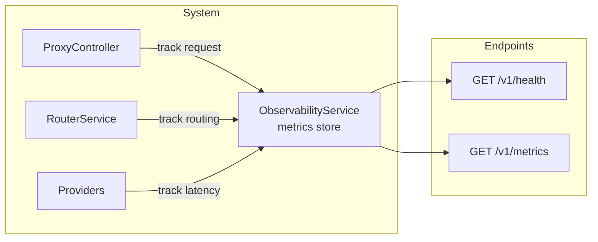
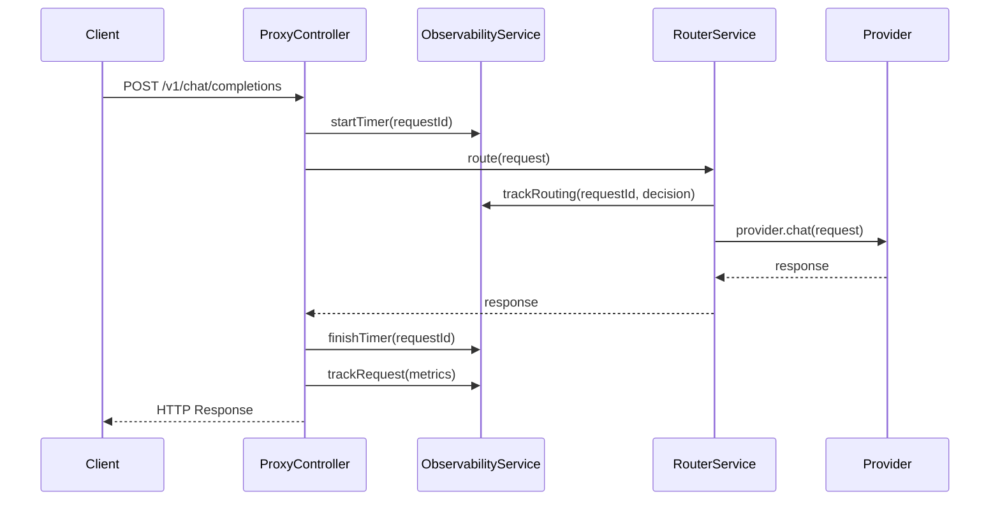
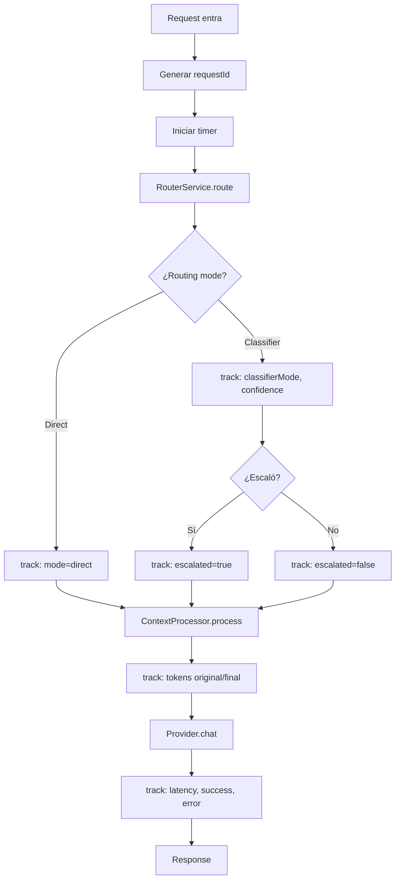

# Observability — Diseño Técnico

## Objetivo

Proporcionar visibilidad sobre el comportamiento del sistema: qué rutas toma cada request,
qué proveedores se usan, cuántos tokens se consumen, latencia, y decisiones de escalado.

Sin observabilidad, es imposible saber si el sistema está ahorrando costes o degradando calidad.

---

## Arquitectura General



---

## Métricas Recolectadas

### Por Request

```typescript
interface RequestMetrics {
  requestId: string;
  timestamp: Date;
  latencyMs: number;

  // Routing
  routingMode: 'direct' | 'classifier';
  classifierMode?: 'plan' | 'execution';
  classifierConfidence?: number;
  escalated: boolean;

  // Provider
  providerType: string;
  providerKey: string;
  model: string;

  // Context
  originalTokens: number;
  finalTokens: number;
  dedupRemoved: number;

  // Response
  finishReason?: string;
  completionTokens?: number;
  success: boolean;
  errorMessage?: string;
}
```

### Agregadas

| Métrica | Descripción | Tipo |
|---|---|---|
| `requests_total` | Total de requests | counter |
| `requests_by_provider` | Requests por proveedor | counter |
| `requests_by_mode` | Requests por modo (direct/classifier) | counter |
| `escalations_total` | Total de escalados | counter |
| `tokens_input_total` | Tokens de entrada totales | counter |
| `tokens_output_total` | Tokens de salida totales | counter |
| `tokens_saved_total` | Tokens ahorrados por context processor | counter |
| `latency_avg_ms` | Latencia promedio en ms | gauge |
| `provider_errors_total` | Errores por proveedor | counter |

---

## Endpoints

### `GET /v1/health`

Health check simple. Usado por OpenCode y load balancers.

```json
{
  "status": "ok",
  "uptime": 3600,
  "version": "0.0.1",
  "providers": {
    "ollama": "connected",
    "cloud": "configured"
  },
  "timestamp": "2026-06-09T00:00:00Z"
}
```

### `GET /v1/metrics`

Métricas agregadas para debugging y monitoreo.

```json
{
  "uptime": 3600,
  "requests": {
    "total": 150,
    "by_provider": {
      "ollama": 120,
      "cloud": 30
    },
    "by_mode": {
      "direct": 100,
      "classifier": 50
    }
  },
  "escalations": {
    "total": 8,
    "rate": 0.053
  },
  "tokens": {
    "input_total": 1250000,
    "output_total": 45000,
    "saved_by_context": 320000
  },
  "latency": {
    "avg_ms": 2850,
    "p50_ms": 1200,
    "p95_ms": 8900
  },
  "errors": {
    "total": 2,
    "by_provider": {
      "ollama": 1,
      "cloud": 1
    }
  }
}
```

---

## Pipeline de Observabilidad



### Flujo Interno



---

## Implementación

### ObservabilityService

```typescript
@Injectable()
export class ObservabilityService {
  private requests: RequestMetrics[] = [];

  startTimer(requestId: string): void { /* ... */ }
  finishTimer(requestId: string): void { /* ... */ }
  trackRequest(metrics: RequestMetrics): void { /* ... */ }
  getMetrics(): MetricsSummary { /* ... */ }
  reset(): void { /* ... */ }
}
```

Almacena en memoria circular (fijo a últimos N requests). Para producción se usaría
una base de datos de series temporales, pero para MVP la memoria es suficiente.

### Integración en RouterService

El RouterService llama a `trackRouting` y `trackRequest` con la información
de la decisión de ruteo y el resultado del context processor.

```typescript
// En RouterService.route()
this.observabilityService.trackRouting({
  requestId,
  mode: 'classifier',
  classifierMode: classification.mode,
  confidence: classification.confidence,
  escalated: decision.shouldEscalate,
  providerKey: selectedProviderKey,
  providerType: modelConfig.type,
  model: modelConfig.model,
});
```

### Integración en ProxyController

El ProxyController es el punto de entrada, por lo que inicia el timer,
atrapara errores y registrará el resultado final.

---

## Logs Estructurados

Cada request produce una línea de log estructurado (JSON):

```
[MetricsService] Request completed: {
  "requestId": "req_abc123",
  "mode": "classifier",
  "classifierMode": "execution",
  "confidence": 0.45,
  "escalated": true,
  "provider": "cloud_nvidia",
  "model": "meta/llama-3.3-70b-instruct",
  "originalTokens": 12500,
  "finalTokens": 8400,
  "savedTokens": 4100,
  "latencyMs": 3400,
  "success": true
}
```

---

## Rotación de Métricas

Las métricas se almacenan en un array circular con capacidad máxima:

| Parámetro | Default | Config |
|---|---|---|
| `maxStoredRequests` | 1000 | `observability.max_stored` |

Cuando se alcanza el límite, los requests más antiguos se descartan.

---

## Endpoints de Health y Métricas

### Implementación en ProxyController

```typescript
@Get('health')
getHealth(): HealthResponse {
  return this.observabilityService.getHealth();
}

@Get('metrics')
getMetrics(): MetricsSummary {
  return this.observabilityService.getMetrics();
}
```

### Seguridad

En MVP no hay autenticación en estos endpoints.
Para producción, deben protegerse (API key, IP whitelist, etc.).

---

## Resumen

```
Endpoint       Método   Descripción
/v1/health     GET      Health check (uptime, providers)
/v1/metrics    GET      Métricas agregadas (tokens, latencia, errores)

Métricas clave:
  - escalations_total / requests_total = escalation rate
  - tokens_saved_total / tokens_input_total = compression ratio
  - latencia p95: ¿está siendo el sistema responsivo?
  - provider_errors: ¿hay proveedores caídos?
```
