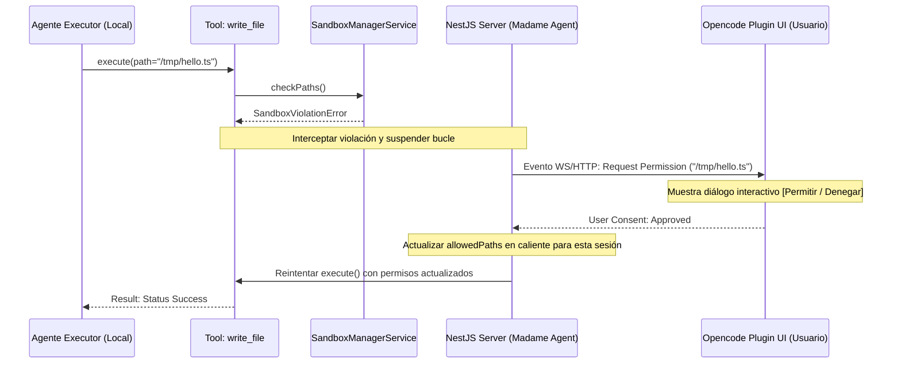

# Propagación Interactiva de Permisos del Sandbox (Interactive Sandbox Permissions)

* **Estado**: Pendiente / Backlog
* **Prioridad**: Media
* **Fecha de Creación**: 2026-06-26

## Contexto del Problema

Actualmente, el sistema de ejecución de agentes de Madame Agent se ejecuta en modo desatendido (headless). Si el modelo local (`gemma4` u otros) intenta ejecutar una herramienta que accede a un archivo fuera del directorio de trabajo (`workspace`) autorizado, el `SandboxManagerService` lanza inmediatamente un error `SandboxViolationError`.

Este error se devuelve directamente al modelo local como un fallo de herramienta ordinario. Aunque esto previene daños al sistema de archivos del usuario, tiene dos desventajas:
1. Si el acceso era legítimo y necesario para la tarea, el modelo no tiene forma de solicitar el permiso al usuario y falla la tarea.
2. Los modelos pequeños a menudo entran en bucles intentando esquivar el Sandbox en lugar de entender el límite.

## Propuesta de Solución: Integración Interactiva con la UI (Opencode)

El objetivo es permitir que las violaciones de sandbox suspendan temporalmente la ejecución y le pregunten físicamente al usuario en el editor (Opencode/VSCode/Antigravity) si desea conceder el permiso en caliente, similar a la herramienta `ask_permission` nativa del plugin de la IDE.

### Flujo Propuesto

### Cambios Arquitectónicos Necesarios

1. **Gestión de Sesión Suspendida**:
   * Introducir un estado de "Suspensión de Bucle" en `ToolLoopService` capaz de pausar la ejecución de una iteración (utilizando promesas diferidas o almacenamiento de estado en base de datos si es asíncrono persistente).
2. **Canal de Comunicación (WebSockets/SSE)**:
   * Implementar un endpoint de eventos en tiempo real en NestJS para notificar al plugin de la IDE sobre la solicitud de permiso pendiente.
3. **Actualización de Reglas del Sandbox en Caliente**:
   * Modificar `SandboxManagerService` para que permita añadir dinámicamente rutas a `allowedPaths` en tiempo de ejecución para una sesión de conversación específica (`sessionAllowedPaths`).
