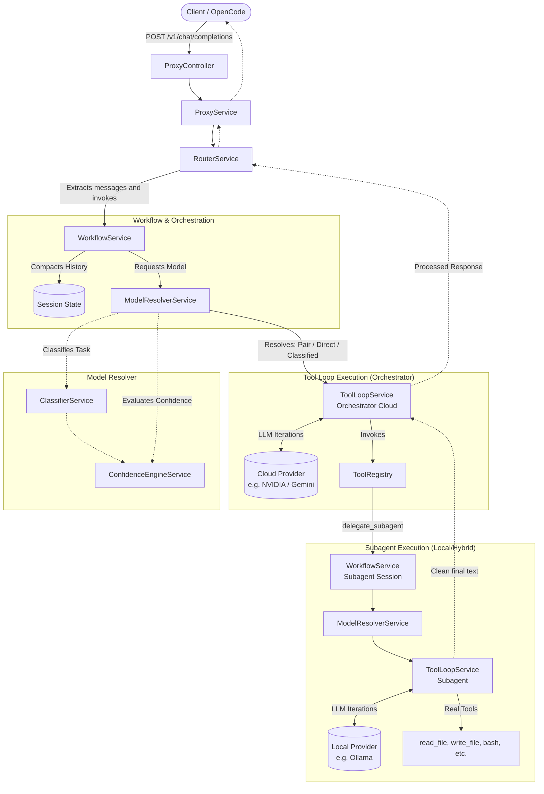

# Madame-Agent - Overview

**Madame-Agent** is an intermediate LLM orchestrator and proxy that acts as a bridge between the client (IDEs, CLI, OpenCode) and multiple model providers (Ollama, NVIDIA, Google, OpenAI, OpenRouter).

Its fundamental purpose is to **optimize token consumption and cloud costs** using intelligent routing strategies, intent classification, semantic caching (Semantic Cache), and hierarchical delegation of complex tasks (Orchestrator → Local/Hybrid Subagents).

---

## 1. Key Architectural Concepts

1. **Orchestrator/Subagent Hierarchy**: Instead of sending an infinite stream of tools, history, or bash output directly to the main model in the cloud, the system delegates the raw work to isolated subagents. Subagents solve the problem and return only the final response or summary, keeping the main context window clean.
2. **Context Compaction (Session Execution Summary)**: `WorkflowService` uses session identifiers (`sessionId`) to compact all the history of the delegation into short summaries, eliminating the need to resend repetitive raw JSON to the orchestrator LLM.
3. **Dynamic Escalation (Fallback/Confidence)**: If a task is evaluated as highly complex (`systemMode === 'plan'`) or if the local subagent loses confidence, the task is automatically "escalated" to a more capable cloud model via `ModelResolverService`.

---

## 2. Flowchart and Main Architecture

The following diagram details the exact flow of the system when a client sends a request, showing the real division of responsibilities in the codebase.

---

## 3. Detailed Documentation Index

The documentation is organized based on the real lifecycle of requests within the system and the services involved:

### ⚙️ Global Planning and Architecture
1. [**Project Plan and Current Status**](./01-architecture-plan.md)  
   *Details the tracking of architecture milestones, global configuration, and advanced features.*
2. [**Plugin Architecture**](./08-plugin-architecture.md)  
   *Guide on how Madame-Agent can dynamically expand capabilities via plugin-based architecture.*

### 🧠 Decision Making and Model Management
3. [**Model Resolver and Dynamic Routing**](./02-model-resolver-and-routing.md)  
   *Explains `ModelResolverService`, selection logic (Direct, Hybrid, Classified), and intent-based escalation.*
4. [**Delegation: Orchestrator and Subagents**](./03-orquestador-subagentes.md)  
   *Technical details of the recursive loop, how `WorkflowService` compacts session state, and how subagents are isolated.*
5. [**Confidence Engine**](./06-confidence-engine.md)  
   *How LLM confidence (MobileBERT Zero-shot) is evaluated against the threshold to force escalations to the cloud.*

### 🛠️ Execution Cycle (Tool Loop)
6. [**Tool Calling Specification**](./04-tool-calling-spec.md)  
   *How `ToolLoopService` injects, processes, and secures the execution of system tools (sandbox).*
7. [**Context Processor**](./05-context-processor.md)  
   *Advanced management, compression, and deduplication of context in history before sending to the LLM.*

### 📊 Integration and Monitoring
8. [**Observability and Metrics**](./07-observability.md)  
   *Observability service, request tracking, token counters, and tool usage monitoring.*
9. [**OpenCode Integration**](./09-integracion-opencode.md)  
   *Configuration to work seamlessly in the local environment as an OpenAI-Compatible Provider for external clients.*
