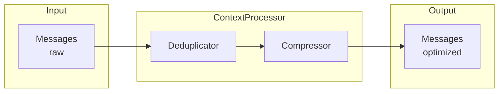
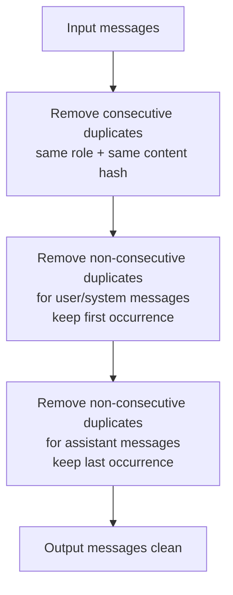
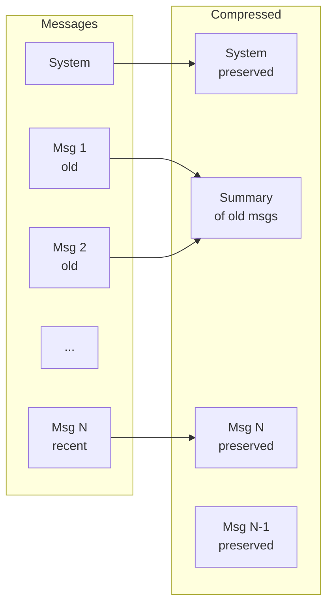
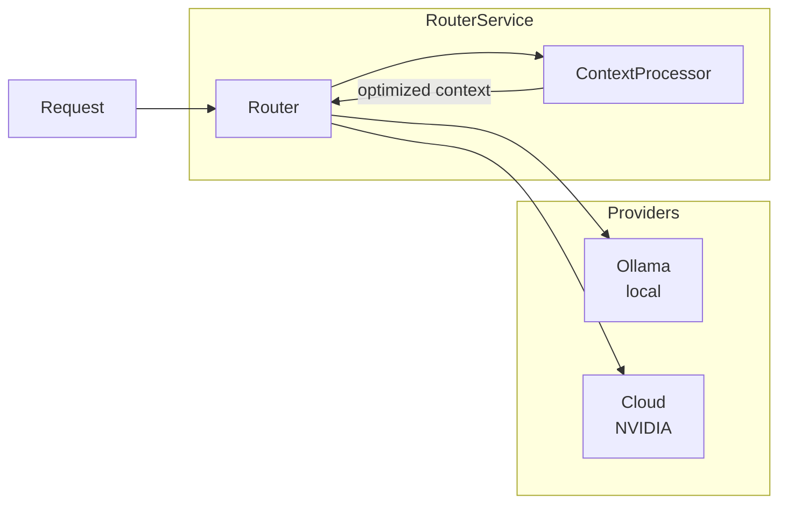
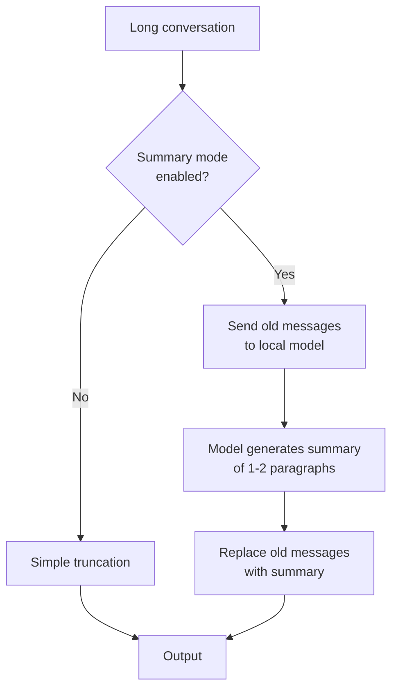

# Context Processor — Technical Design

## Goal

To reduce the number of tokens sent to language models (both local and cloud) without losing relevant information for the task.

The Context Processor does NOT modify prompts. It optimizes **context**.

---

## General Architecture



The pipeline is sequential and deterministic:

1. **Deduplication** — removes redundancy
2. **Compression** — reduces the size of the remaining context

---

## Phase 1: Deduplication

### Problem

In sessions with agents/IDEs, it is common for the same content to appear multiple times:

- Files sent repeatedly in failed tool calls
- Repeated error logs
- The user pasting the same snippet multiple times
- Duplicate system messages

### Algorithm



### Rules

| Rule | Description |
|---|---|
| **Consecutive** | If `msg[n]` has the same `role` and same `content` as `msg[n-1]`, remove `msg[n]` |
| **Duplicate User/System** | If the same content appears later with user/system role, keep only the first |
| **Duplicate Assistant** | If the same content appears later with assistant role, keep only the last |
| **Tool calls** | `tool_calls` are compared using exact JSON serialization |

### Implementation

```typescript
interface DedupResult {
  messages: Message[];
  removedCount: number;
  reason: string;
}

class DeduplicatorService {
  deduplicate(messages: Message[]): DedupResult {
    let removedCount = 0;
    let reasons: string[] = [];

    // 1. Remove consecutive duplicates
    const pass1 = messages.filter((msg, i, arr) => {
      if (i === 0) return true;
      const prev = arr[i - 1];
      if (msg.role === prev.role && contentHash(msg) === contentHash(prev)) {
        removedCount++;
        reasons.push(`consecutive duplicate #${i} (${msg.role})`);
        return false;
      }
      return true;
    });

    // 2. Deduplicate non-consecutive by role
    const seen = new Map<string, number[]>(); // hash → indexes
    // ...tracking logic...

    return { messages: pass1, removedCount, reason: reasons.join('; ') };
  }
}
```

---

## Phase 2: Compression

### Problem

Long conversations can exceed the model's context window (e.g., 8K, 32K, 128K tokens).
Inference cost scales quadratically with context length in transformers.

### Strategy



### Rules

| Priority | What is preserved | Why |
|---|---|---|
| 1 | System prompt | Defines model behavior |
| 2 | Last N messages | Immediate context of the conversation |
| 3 | Messages with tool_calls | Indicates ongoing actions |
| 4 | Messages with tool_call_id | Tool call responses |

### Token Counting

For the MVP, a deterministic approximation is used without a language model:

```typescript
function estimateTokens(text: string): number {
  // Approximation: 1 token ≈ 4 characters for English
  // Worst case for code/symbols: 1 token ≈ 2 characters
  return Math.ceil(text.length / 3.5);
}

function estimateMessageTokens(msg: Message): number {
  let total = 4; // overhead per message (role, metadata)
  if (typeof msg.content === 'string') {
    total += estimateTokens(msg.content);
  } else if (Array.isArray(msg.content)) {
    for (const part of msg.content) {
      total += estimateTokens(JSON.stringify(part));
    }
  }
  if (msg.tool_calls) total += estimateTokens(JSON.stringify(msg.tool_calls));
  return total;
}
```

### Compression Pipeline

```mermaid
flowchart TD
    A[Messages] --> B[Estimate total tokens]
    B --> C{Total > maxTokens?}
    C -->|No| D[Output intact]
    C -->|Yes| E[Mark messages as<br/>preserve or compress]
    E --> F[System: always preserve]
    E --> G[Last keepLast: preserve]
    E --> H[Intermediate messages: truncate]
    H --> I{content > maxChars?}
    I -->|Yes| J[Truncate to maxChars<br/>with notice '[truncated]']
    I -->|No| K[Keep intact]
    J --> L[Compressed output]
    K --> L
    F --> L
    G --> L
```

### Configurable Parameters

```yaml
context:
  max_tokens: 8192         # Upper limit of tokens
  keep_last: 10            # Recent messages to always preserve
  max_message_chars: 4000  # Max characters per message
  summary_model: null      # null = truncation; future: "gemma4:12b-mlx"
  enabled: true
```

---

## Integration with the Router



The Context Processor is applied **before** sending to the provider, but **after** routing.
This allows routing to decide based on request metadata, not compressed context.

```typescript
async route(request: ChatCompletionRequest): Promise<ProviderResponse> {
  // 1. Decide provider and model (routing)
  const provider = this.selectProvider(request);

  // 2. Optimize context
  const optimized = await this.contextProcessor.process(
    request.messages,
    { maxTokens: provider.contextLimit }
  );
  request.messages = optimized.messages;

  // 3. Send to provider
  return provider.chat(request, modelConfig);
}
```

---

## Future Strategy: Compression with Local Model

When the local model is idle, it can be used to **summarize** old messages:



This requires:
- Job queue to not block requests
- Summary cache by session_id
- Summary quality evaluation

Not implemented in the MVP.

---

## Metrics and Observability

The Context Processor exposes:

| Metric | Description |
|---|---|
| `context.removed_tokens` | Tokens removed by deduplication |
| `context.compressed_tokens` | Tokens removed by compression |
| `context.original_tokens` | Tokens before processing |
| `context.final_tokens` | Tokens after processing |
| `context.compression_ratio` | `final / original` |
| `context.dedup_removed_count` | Messages removed by dedup |

---

## Summary

```
Input:     10 messages, ~12K tokens
               ↓
Dedup:     -2 duplicate messages (~2.4K tokens)
               ↓
Compress:  -3 truncated messages (~4K tokens)
               ↓
Output:    8 messages, ~5.6K tokens  (ratio: 0.47)
```

The Context Processor does not improve model quality.
It reduces cost and latency by eliminating what the model does not need.
