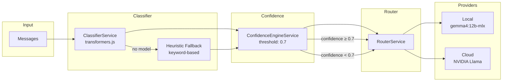
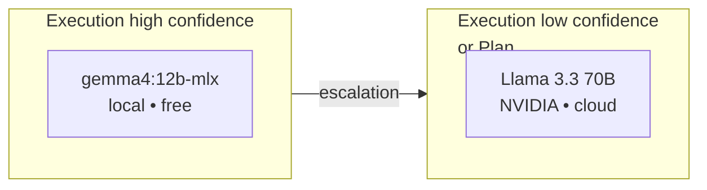
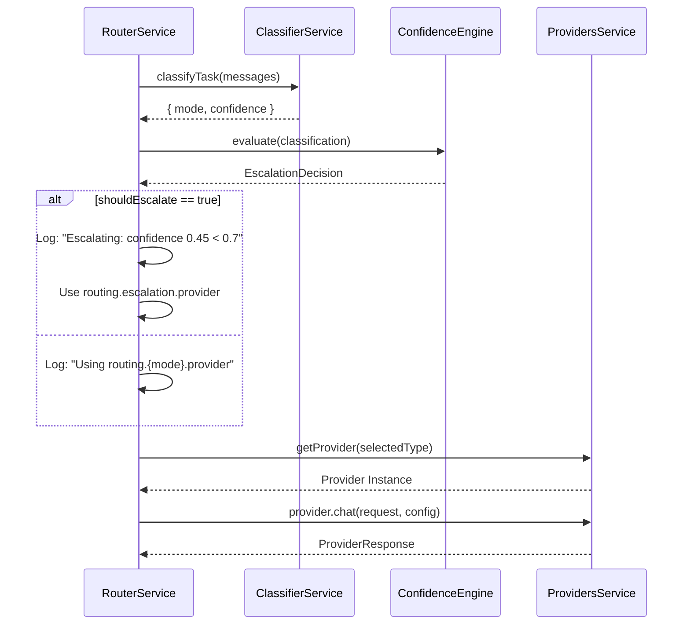
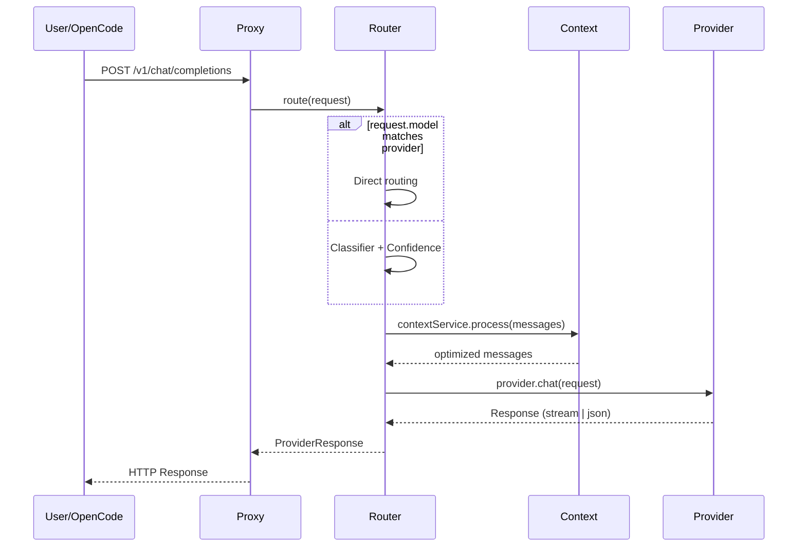

# Confidence Engine + Escalation System — Technical Design

## Goal

To decide when to escalate from a local model to a cloud model based on the **confidence** the classifier has about the task type. If confidence is low, a more capable (and more expensive) model is used.

---

## General Architecture



---

## Phase 1: Task Classifier

### Zero-Shot Classification

The classifier uses **mobilebert-uncased-mnli** via `@xenova/transformers`.
It does not require fine-tuning: it works with zero-shot classification on two predefined labels.

### Labels

| Label | Description | Route |
|---|---|---|
| `system planning and architecture` | Design, planning, architecture tasks | → cloud (plan) |
| `code execution and simple fix` | Implementation, debugging, simple refactors | → local (execution) |

### Pipeline

```mermaid
flowchart TD
    A[User Messages] --> B[Serialize to JSON string]
    B --> C{ClassifierService<br/>initialized?}
    C -->|Yes| D[zero-shot classification<br/>mobilebert-uncased-mnli]
    C -->|No| E[Heuristic Fallback<br/>keywords: plan, architect, system design]
    D --> F{Label[0] === 'planning'?}
    F -->|Yes| G[{ mode: 'plan', confidence: scores[0] }]
    F -->|No| H[{ mode: 'execution', confidence: scores[0] }]
    E --> I[{ mode: 'plan'|'execution', confidence: 0.5 }]
```

### Heuristic Fallback

When the model is not available (not downloaded, error), a deterministic fallback based on keywords is used:

```typescript
private heuristicFallback(text: string): ClassificationResult {
  const textLower = text.toLowerCase();
  if (textLower.includes('plan') ||
      textLower.includes('architect') ||
      textLower.includes('system design')) {
    return { mode: 'plan', confidence: 0.5 };
  }
  return { mode: 'execution', confidence: 0.5 };
}
```

A confidence of 0.5 in fallback **always** triggers escalation because it is below the threshold of 0.7.

---

## Phase 2: Confidence Engine

### Configurable Threshold

The threshold is defined in `routing.yaml`:

```yaml
confidence:
  threshold: 0.70
```

If not configured, the default value is `0.7`.

### Decision Rule

```mermaid
flowchart TD
    A[ClassificationResult<br/>{ mode, confidence }] --> B{confidence < threshold?}
    B -->|Yes| C[shouldEscalate = true]
    B -->|No| D[shouldEscalate = false]
    C --> E[targetProviderKey = routing.escalation.provider]
    D --> F[targetProviderKey = routing.{mode}.provider]
    E --> G[EscalationDecision]
    F --> G
```

### Implementation

```typescript
evaluate(result: ClassificationResult): EscalationDecision {
  const threshold = this.configService.get('confidence')?.threshold ?? 0.7;
  const routing = this.configService.get('routing') || {};

  const shouldEscalate = result.confidence < threshold;

  return {
    shouldEscalate,
    threshold,
    confidence: result.confidence,
    targetProviderKey: shouldEscalate
      ? routing.escalation?.provider    // e.g., cloud_nvidia
      : routing[result.mode]?.provider, // e.g., local_medium
  };
}
```

### Example Cases

| Mode | Confidence | Threshold | Escalates? | Target Provider |
|---|---|---|---|---|
| execution | 0.95 | 0.7 | No | `local_medium` (local gemma4) |
| execution | 0.45 | 0.7 | **Yes** | `cloud_nvidia` (cloud Llama) |
| plan | 0.91 | 0.7 | No | `cloud_nvidia` (cloud Llama) |
| plan | 0.30 | 0.7 | **Yes** | `cloud_nvidia` (cloud Llama) |
| execution | 0.50 | 0.7 | **Yes** | `cloud_nvidia` (fallback) |

---

## Phase 3: Escalation System

### Escalation Chain

The system supports multi-level escalation, although only two levels exist in the MVP:



### Integration with RouterService



### Configuration in routing.yaml

```yaml
providers:
  local_medium:
    type: ollama
    model: gemma4:12b-mlx      # 🟢 local, free
  cloud_nvidia:
    type: cloud
    provider: nvidia
    model: meta/llama-3.3-70b-instruct  # 🔵 cloud, paid

routing:
  plan:
    provider: cloud_nvidia      # Plan always to cloud
  execution:
    provider: local_medium      # Execution to local
  escalation:
    provider: cloud_nvidia      # Escalated to cloud

confidence:
  threshold: 0.70               # If confidence < 0.7 → escalate
```

---

## Full Flow



---

## Configuration and Threshold

The 0.7 threshold is a conservative starting value. Recommended adjustments:

| Threshold | Behavior | Usage |
|---|---|---|
| 0.9 | Almost everything escalates to cloud | Max quality, max cost |
| 0.7 | Balanced (default) | Quality/cost balance |
| 0.5 | Only escalates doubtful cases | More local, more savings |
| 0.3 | Almost nothing escalates | Max savings, quality risk |

---

## Summary

```
Input: "fix this bug in the login page"
  ↓
Classifier: { mode: 'execution', confidence: 0.92 }
  ↓
Confidence: 0.92 ≥ 0.7 → NO escalation
  ↓
Provider: local_medium → gemma4:12b-mlx (free)
  ↓
Output: response from local model


Input: "design the entire auth system architecture"
  ↓
Classifier: { mode: 'plan', confidence: 0.88 }
  ↓
Confidence: 0.88 ≥ 0.7 → NO escalation (but goes to cloud because it's 'plan')
  ↓
Provider: cloud_nvidia → Llama 3.3 70B (cloud)
  ↓
Output: response from cloud model


Input: "i dunno just make it work somehow"
  ↓
Classifier: { mode: 'execution', confidence: 0.35 }
  ↓
Confidence: 0.35 < 0.7 → ESCALATION
  ↓
Provider: cloud_nvidia → Llama 3.3 70B (cloud)
  ↓
Output: response from cloud model
```
