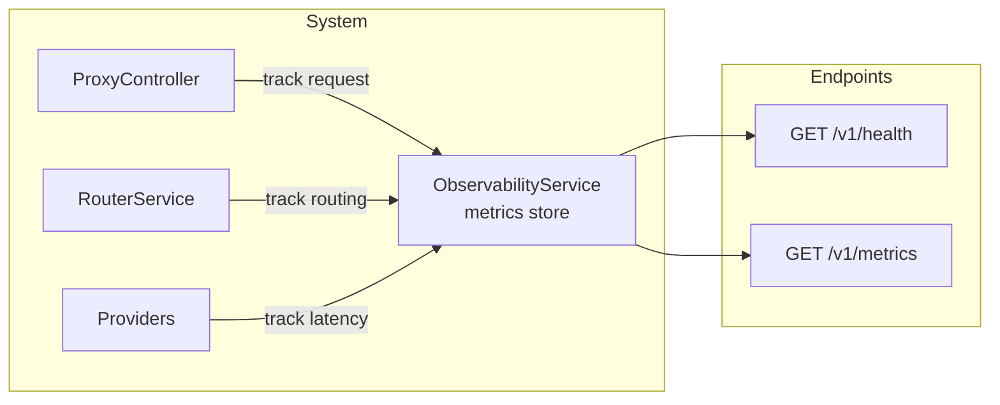
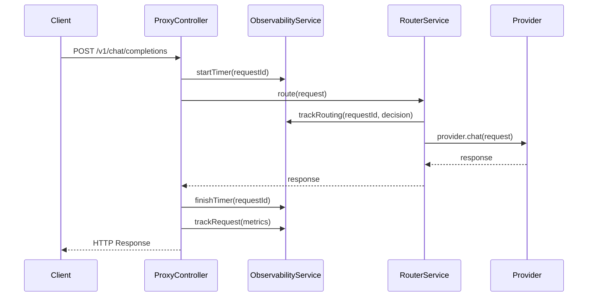
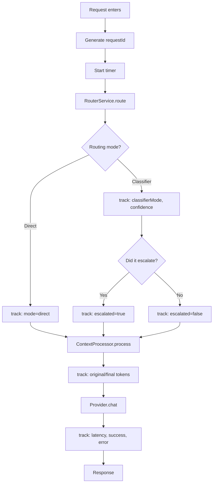

# Observability — Technical Design

## Goal

To provide visibility into the system's behavior: which routes each request takes, which providers are used, how many tokens are consumed, latency, and escalation decisions.

Without observability, it is impossible to know if the system is saving costs or degrading quality.

---

## General Architecture



---

## Collected Metrics

### Per Request

```typescript
interface RequestMetrics {
  requestId: string;
  timestamp: Date;
  latencyMs: number;

  // Routing
  routingMode: 'direct' | 'classifier';
  classifierMode?: 'plan' | 'execution';
  classifierConfidence?: number;
  escalated: boolean;

  // Provider
  providerType: string;
  providerKey: string;
  model: string;

  // Context
  originalTokens: number;
  finalTokens: number;
  dedupRemoved: number;

  // Response
  finishReason?: string;
  completionTokens?: number;
  success: boolean;
  errorMessage?: string;
}
```

### Aggregated

| Metric | Description | Type |
|---|---|---|
| `requests_total` | Total requests | counter |
| `requests_by_provider` | Requests per provider | counter |
| `requests_by_mode` | Requests by mode (direct/classifier) | counter |
| `escalations_total` | Total escalations | counter |
| `tokens_input_total` | Total input tokens | counter |
| `tokens_output_total` | Total output tokens | counter |
| `tokens_saved_total` | Tokens saved by context processor | counter |
| `latency_avg_ms` | Average latency in ms | gauge |
| `provider_errors_total` | Errors per provider | counter |

---

## Endpoints

### `GET /v1/health`

Simple health check. Used by OpenCode and load balancers.

```json
{
  "status": "ok",
  "uptime": 3600,
  "version": "0.0.1",
  "providers": {
    "ollama": "connected",
    "cloud": "configured"
  },
  "timestamp": "2026-06-09T00:00:00Z"
}
```

### `GET /v1/metrics`

Aggregated metrics for debugging and monitoring.

```json
{
  "uptime": 3600,
  "requests": {
    "total": 150,
    "by_provider": {
      "ollama": 120,
      "cloud": 30
    },
    "by_mode": {
      "direct": 100,
      "classifier": 50
    }
  },
  "escalations": {
    "total": 8,
    "rate": 0.053
  },
  "tokens": {
    "input_total": 1250000,
    "output_total": 45000,
    "saved_by_context": 320000
  },
  "latency": {
    "avg_ms": 2850,
    "p50_ms": 1200,
    "p95_ms": 8900
  },
  "errors": {
    "total": 2,
    "by_provider": {
      "ollama": 1,
      "cloud": 1
    }
  }
}
```

---

## Observability Pipeline



### Internal Flow



---

## Implementation

### ObservabilityService

```typescript
@Injectable()
export class ObservabilityService {
  private requests: RequestMetrics[] = [];

  startTimer(requestId: string): void { /* ... */ }
  finishTimer(requestId: string): void { /* ... */ }
  trackRequest(metrics: RequestMetrics): void { /* ... */ }
  getMetrics(): MetricsSummary { /* ... */ }
  reset(): void { /* ... */ }
}
```

Metrics are stored in circular memory (fixed to the last N requests). For production, a time-series database would be used, but for the MVP, memory is sufficient.

### Integration in RouterService

The RouterService calls `trackRouting` and `trackRequest` with the routing decision details and the context processor outcome.

```typescript
// Inside RouterService.route()
this.observabilityService.trackRouting({
  requestId,
  mode: 'classifier',
  classifierMode: classification.mode,
  confidence: classification.confidence,
  escalated: decision.shouldEscalate,
  providerKey: selectedProviderKey,
  providerType: modelConfig.type,
  model: modelConfig.model,
});
```

### Integration in ProxyController

`ProxyController` is the entry point, so it starts the timer, catches errors, and logs the final result.

---

## Structured Logs

Each request produces a single structured log line (JSON):

```
[MetricsService] Request completed: {
  "requestId": "req_abc123",
  "mode": "classifier",
  "classifierMode": "execution",
  "confidence": 0.45,
  "escalated": true,
  "provider": "cloud_nvidia",
  "model": "meta/llama-3.3-70b-instruct",
  "originalTokens": 12500,
  "finalTokens": 8400,
  "savedTokens": 4100,
  "latencyMs": 3400,
  "success": true
}
```

---

## Metrics Rotation

Metrics are stored in a circular array with a maximum capacity:

| Parameter | Default | Config |
|---|---|---|
| `maxStoredRequests` | 1000 | `observability.max_stored` |

Once the limit is reached, older requests are discarded.

---

## Health and Metrics Endpoints

### Implementation in ProxyController

```typescript
@Get('health')
getHealth(): HealthResponse {
  return this.observabilityService.getHealth();
}

@Get('metrics')
getMetrics(): MetricsSummary {
  return this.observabilityService.getMetrics();
}
```

### Security

In the MVP, there is no authentication on these endpoints.
For production, they must be secured (API key, IP whitelist, etc.).

---

## Summary

```
Endpoint       Method   Description
/v1/health     GET      Health check (uptime, providers)
/v1/metrics    GET      Aggregated metrics (tokens, latency, errors)

Key Metrics:
  - escalations_total / requests_total = escalation rate
  - tokens_saved_total / tokens_input_total = compression ratio
  - p95 latency: is the system responsive?
  - provider_errors: are there down providers?
```
