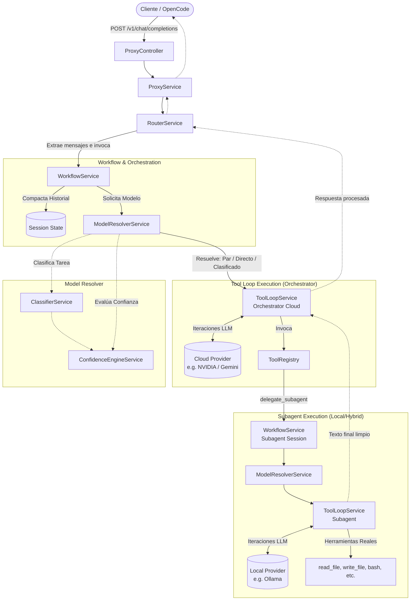

# Madame-Agent - Overview

**Madame-Agent** es un orquestador y proxy intermedio de LLMs que actúa como puente entre el cliente (IDEs, CLI, OpenCode) y los múltiples proveedores de modelos (Ollama, NVIDIA, Google, OpenAI, OpenRouter).

Su propósito fundamental es **optimizar el consumo de tokens y costes cloud** mediante estrategias de enrutamiento inteligente, clasificación de intenciones, almacenamiento en caché semántica (Semantic Cache) y delegación jerárquica de tareas complejas (Orquestador → Subagentes Locales/Híbridos).

---

## 1. Conceptos Clave de la Arquitectura

1. **Jerarquía Orquestador/Subagente**: En lugar de enviar un flujo infinito de herramientas, historial, o salidas de bash directamente al modelo principal en la nube, el sistema asigna el trabajo bruto a subagentes aislados. Los subagentes resuelven el problema y devuelven solo la respuesta o el resumen, manteniendo limpia la ventana de contexto principal.
2. **Compactación de Contexto (Session Execution Summary)**: `WorkflowService` utiliza identificadores de sesión (`sessionId`) para compactar todo el rastro de la delegación en resúmenes cortos, eliminando la necesidad de reenviar JSONs crudos repetitivos al LLM orquestador.
3. **Escalamiento Dinámico (Fallback/Confidence)**: Si la tarea es evaluada como muy compleja (`systemMode === 'plan'`) o si el subagente local pierde confianza, la tarea se "escala" automáticamente a un modelo cloud más capaz a través del `ModelResolverService`.

---

## 2. Diagrama de Flujo y Arquitectura Principal

El siguiente diagrama detalla el flujo exacto del sistema cuando un cliente envía una petición, mostrando la división de responsabilidades real en el código base.

---

## 3. Índice de Documentación Detallada

La documentación ha sido organizada basándose en el ciclo de vida real de las peticiones dentro del sistema y los servicios que intervienen:

### ⚙️ Planificación y Arquitectura Global
1. [**Plan del Proyecto y Estado Actual**](./01-architecture-plan.md)  
   *Detalla el seguimiento de hitos de la arquitectura, configuración global y funcionalidades avanzadas.*
2. [**Arquitectura de Plugins**](./08-plugin-architecture.md)  
   *Guía sobre cómo Madame-Agent puede expandir capacidades dinámicamente mediante arquitectura basada en plugins.*

### 🧠 Toma de Decisiones y Gestión de Modelos
3. [**Model Resolver y Enrutamiento Dinámico**](./02-model-resolver-and-routing.md)  
   *Explica el `ModelResolverService`, la lógica de selección (Direct, Híbrido, Clasificado) y el escalamiento basado en intenciones.*
4. [**Delegación: Orquestador y Subagentes**](./03-orquestador-subagentes.md)  
   *Detalle técnico del bucle recursivo, cómo interactúa el `WorkflowService` compactando el estado y cómo se aíslan los subagentes.*
5. [**Motor de Confianza (Confidence Engine)**](./06-confidence-engine.md)  
   *Cómo se evalúa la confianza del LLM (MobileBERT Zero-shot) frente al umbral para forzar escalamientos a la nube.*

### 🛠️ Ciclo de Ejecución (Tool Loop)
6. [**Especificación de Tool Calling**](./04-tool-calling-spec.md)  
   *Cómo el `ToolLoopService` inyecta, procesa y asegura la ejecución de herramientas del sistema (sandbox).*
7. [**Context Processor**](./05-context-processor.md)  
   *Manejo avanzado, compresión y deduplicación de contexto en el historial antes de enviarse al LLM.*

### 📊 Integración y Monitoreo
8. [**Observabilidad y Métricas**](./07-observability.md)  
   *Servicio de observabilidad, tracking request, contadores de tokens y monitorización del uso de herramientas.*
9. [**Integración con OpenCode**](./09-integracion-opencode.md)  
   *Configuración para funcionar fluidamente en el entorno local como Provider OpenAI-Compatible para clientes externos.*
